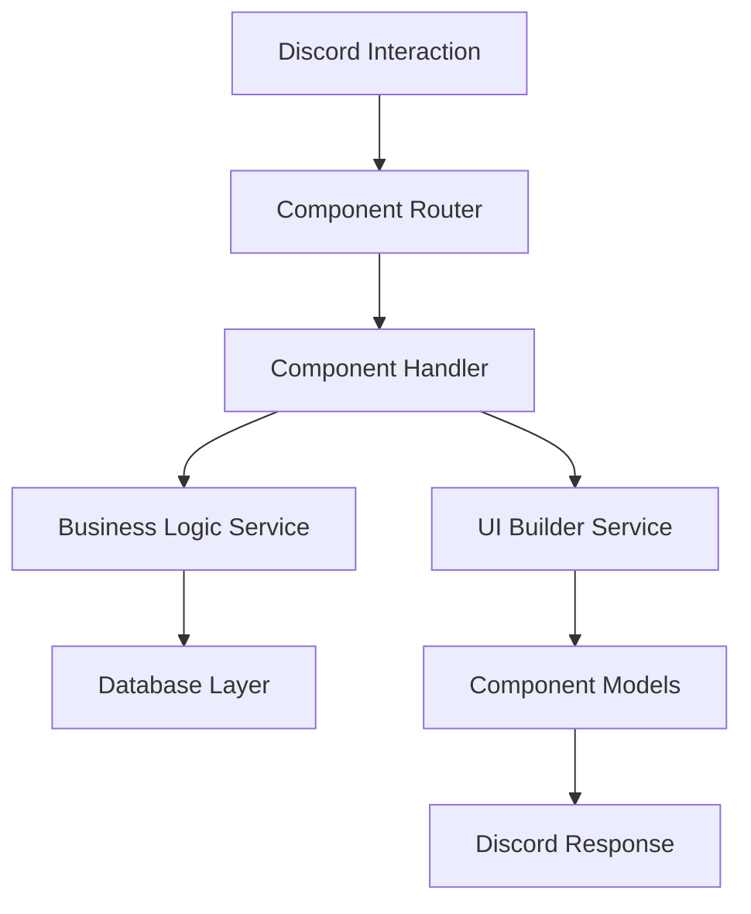

# Design Document

## Overview

This design outlines the modernization of the HuTao Discord bot to fully utilize Discord.Net's Components V2 system. The modernization involves implementing missing component types, creating a sophisticated moderation history interface, and updating all bot interactions to use modern Discord UI components. The design emphasizes maintainability, user experience, and backward compatibility while leveraging the latest Discord UI capabilities.

## Architecture

### Component System Architecture

The component system will be organized into several layers:

1. **Component Models Layer**: Core component type definitions and builders
2. **Component Service Layer**: Component interaction handling and state management
3. **UI Builder Layer**: High-level builders for complex UI patterns
4. **Integration Layer**: Integration with existing bot services and commands



### Moderation History Architecture

The moderation history system will use a component-based approach:

1. **History View Builder**: Constructs the complete history interface
2. **Reprimand Component Factory**: Creates individual reprimand display components
3. **Action Handler Service**: Processes user interactions with history components
4. **Note Management Service**: Handles attachment and management of contextual notes

## Components and Interfaces

### Core Component Types

Based on Discord's Components V2 specification and the provided JSON/YAML examples, the following component types need implementation or completion:

#### 1. Container Component (Type 17)
```csharp
public class ContainerComponent : IMessageComponent
{
    public ComponentType Type => ComponentType.Container;
    public uint? AccentColor { get; set; }
    public bool Spoiler { get; set; }
    public List<IMessageComponent> Components { get; set; } = new();
}

public class ContainerBuilder
{
    public ContainerBuilder WithAccentColor(uint? color);
    public ContainerBuilder WithSpoiler(bool spoiler);
    public ContainerBuilder AddComponent(IMessageComponent component);
    public ContainerComponent Build();
}
```

#### 2. Section Component (Type 9)
```csharp
public class SectionComponent : IMessageComponent
{
    public ComponentType Type => ComponentType.Section;
    public IMessageComponent? Accessory { get; set; }
    public List<IMessageComponent> Components { get; set; } = new();
}

public class SectionBuilder
{
    public SectionBuilder WithAccessory(IMessageComponent accessory);
    public SectionBuilder AddComponent(IMessageComponent component);
    public SectionComponent Build();
}
```

#### 3. Text Display Component (Type 10)
```csharp
public class TextDisplayComponent : IMessageComponent
{
    public ComponentType Type => ComponentType.TextDisplay;
    public string Content { get; set; } = string.Empty;
}

public class TextDisplayBuilder
{
    public TextDisplayBuilder WithContent(string content);
    public TextDisplayComponent Build();
}
```

#### 4. Thumbnail Component (Type 11)
```csharp
public class ThumbnailComponent : IMessageComponent
{
    public ComponentType Type => ComponentType.Thumbnail;
    public MediaInfo Media { get; set; } = new();
    public string? Description { get; set; }
    public bool Spoiler { get; set; }
}

public class ThumbnailBuilder
{
    public ThumbnailBuilder WithUrl(string url);
    public ThumbnailBuilder WithDescription(string description);
    public ThumbnailBuilder WithSpoiler(bool spoiler);
    public ThumbnailComponent Build();
}
```

#### 5. Separator Component (Type 14)
```csharp
public class SeparatorComponent : IMessageComponent
{
    public ComponentType Type => ComponentType.Separator;
    public bool Divider { get; set; }
    public int Spacing { get; set; } = 1;
}

public class SeparatorBuilder
{
    public SeparatorBuilder WithDivider(bool divider = true);
    public SeparatorBuilder WithSpacing(int spacing);
    public SeparatorComponent Build();
}
```

### Component Service Interfaces

#### IComponentInteractionService
```csharp
public interface IComponentInteractionService
{
    Task<ComponentInteractionResult> HandleInteractionAsync(SocketMessageComponent interaction);
    Task RegisterHandlerAsync<T>(string customIdPattern, Func<T, Task> handler) where T : SocketMessageComponent;
    string GenerateCustomId(string prefix, params object[] parameters);
}
```

#### IHistoryUIService
```csharp
public interface IHistoryUIService
{
    Task<MessageComponent> BuildHistoryViewAsync(IGuildUser user, ModerationCategory? category = null);
    Task<MessageComponent> BuildReprimandComponentAsync(Reprimand reprimand, bool includeActions = true);
    Task HandleReprimandActionAsync(SocketMessageComponent interaction, ReprimandAction action);
}
```

## Data Models

### Component Interaction Models

#### ComponentInteractionContext
```csharp
public class ComponentInteractionContext
{
    public SocketMessageComponent Interaction { get; set; }
    public IGuildUser User { get; set; }
    public IGuild Guild { get; set; }
    public IMessageChannel Channel { get; set; }
    public Dictionary<string, object> Parameters { get; set; } = new();
}
```

#### ReprimandNote
```csharp
public class ReprimandNote : IEntity<Guid>
{
    public Guid Id { get; set; }
    public Guid ReprimandId { get; set; }
    public virtual Reprimand Reprimand { get; set; } = null!;
    public string Content { get; set; } = string.Empty;
    public ulong AuthorId { get; set; }
    public DateTimeOffset CreatedAt { get; set; }
    public DateTimeOffset? UpdatedAt { get; set; }
}
```

### Enhanced Reprimand Models

Extend existing reprimand models to support component interactions:

```csharp
public partial class Reprimand
{
    public virtual ICollection<ReprimandNote> Notes { get; set; } = new List<ReprimandNote>();
    
    public ComponentBuilder ToComponentV2Builder(bool ephemeral = false)
    {
        // Implementation for Components V2
    }
}
```

## Error Handling

### Component Interaction Error Handling

```csharp
public class ComponentInteractionErrorHandler
{
    public async Task HandleErrorAsync(SocketMessageComponent interaction, Exception exception)
    {
        var errorEmbed = new EmbedBuilder()
            .WithTitle("Interaction Error")
            .WithDescription("An error occurred while processing your request.")
            .WithColor(Color.Red)
            .Build();

        if (interaction.HasResponded)
            await interaction.FollowupAsync(embed: errorEmbed, ephemeral: true);
        else
            await interaction.RespondAsync(embed: errorEmbed, ephemeral: true);
    }
}
```

### Graceful Degradation

For clients that don't support Components V2:
- Fallback to traditional embed-based interfaces
- Maintain functional parity with reduced visual appeal
- Automatic detection of client capabilities

## Testing Strategy

### Unit Testing

1. **Component Builder Tests**: Verify correct component construction
2. **Interaction Handler Tests**: Test component interaction processing
3. **UI Builder Tests**: Validate complex UI construction
4. **Serialization Tests**: Ensure proper JSON serialization/deserialization

### Integration Testing

1. **End-to-End Component Flow**: Test complete user interaction flows
2. **Database Integration**: Verify component state persistence
3. **Discord API Integration**: Test actual Discord component rendering
4. **Backward Compatibility**: Ensure legacy functionality remains intact

### Test Structure

```csharp
[TestClass]
public class ComponentBuilderTests
{
    [TestMethod]
    public void ContainerBuilder_ShouldCreateValidContainer()
    {
        // Test container component creation
    }

    [TestMethod]
    public void HistoryUIService_ShouldBuildCompleteHistoryView()
    {
        // Test complete history UI construction
    }
}
```

## Implementation Phases

### Phase 1: Core Component Implementation
- Implement missing component types
- Create component builders
- Set up basic serialization

### Phase 2: Component Service Layer
- Implement interaction routing
- Create component state management
- Set up error handling

### Phase 3: Moderation History Modernization
- Build history UI service
- Implement reprimand note system
- Create action handlers

### Phase 4: Bot-wide Integration
- Update all existing commands
- Implement component-based settings
- Modernize profile interfaces

### Phase 5: Testing and Optimization
- Comprehensive testing
- Performance optimization
- Documentation and deployment

## Security Considerations

### Component Security

1. **Custom ID Validation**: Validate all custom IDs to prevent injection attacks
2. **Permission Checking**: Verify user permissions before processing interactions
3. **Rate Limiting**: Implement rate limiting for component interactions
4. **State Validation**: Validate component state before processing

### Data Protection

1. **Sensitive Data Handling**: Ensure sensitive moderation data is properly protected
2. **Access Control**: Implement proper access controls for moderation history
3. **Audit Logging**: Log all component interactions for audit purposes

## Performance Considerations

### Component Caching

- Cache frequently accessed component structures
- Implement intelligent cache invalidation
- Use memory-efficient component representations

### Database Optimization

- Optimize queries for history retrieval
- Implement pagination for large history sets
- Use appropriate database indexes

### Discord API Optimization

- Batch component updates where possible
- Minimize API calls through efficient state management
- Implement proper retry logic for failed interactions